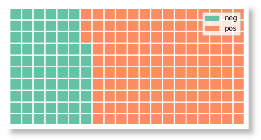
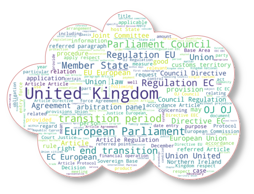

# Welcome to TwitterML
Project to analyse text streams (tweets or docs) using big data and machine learning. Uses Apache Spark to built textual metrics, then processes the text via various classification models to evaluate the sentiment (models via SciKit-Learn).

* Free software: GNU General Public License v3
* Documentation: https://twitter_ml.readthedocs.io

## Features
* Text Classify - a standalone program for classifying the sentiment of text using NLTK
* Document Scanner - a program for classifying text documents on the Spark platform
* Twitter-Kafka Publisher - reads tweets from Twitter and pumps them into a Kafka server (where they can be consumed by out Twitter Consumer programs).
* Twitter Analyser - reads tweets from Kafka and performs analysis of the text using the Spark platform.
